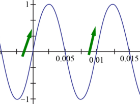

# MakoMonoTone
A demo JUCE VST mono guitar synthesizer and digital delay.
* Tested on Windows only.
* Written in Visual C++ 2022.
* Written for new programmers, not complicated.
* Version: 1.00
* Posted: June 17, 2024

VERSION
------------------------------------------------------------------
1.00 - Initial release.

DISCLAIMER
------------------------------------------------------------------  
This VST was written in a very simple way. Just simple code for
people who are not programmers but want to dabble in the magic of JUCE VSTs.

If you are new to JUCE code, the Mako Thump VST may be a better
starting place. Or be brave and try this.
       
SUMMARY
------------------------------------------------------------------
A Juce/C++ VST3 written to create a monophonic synth sound from your guitar.


# THEORY OF OPERATION<br />
PSUEDO SYNTHESIZER  
This VST calculates the pitch of a guitar note by measuring the time betweem positive edge zero crossings.

  
FIGURE 1  

In this example the sine wave crosses at time 0s and then again at time .01s. 
* Frequency/pitch f = 1 / (.01s - 0s) = 100Hz.

Our app will count the samples between crossings to get the time.
* Time = Sample Count / Sample Rate
* .01s = 480/48000

The measured pitch value is then used to create various waveforms. 

PURE SINE WAVE  
For our VST to work the guitar notes need to closely resemble a sine wave. Guitar notes rarley resemble a sine wave. There are usually a lot
of harmonics that create strange shapes. 

To get the easiest to detect notes, the guitar should use its neck pickup and have the tone control rolled all the way down. This helps remove 
the extra harmonic content. 

The VST also adds a LOW PASS filter to further remove unwanted harmonics.
* 100 Hz Low Pass is good for lower guitar notes.
* 200 Hz Low Pass is good for higher notes. 

GLISSANDO  
By blending the pitch with the previous pitch value, we can create a Glissando effect. This slows the change from note to note
to create a sliding up/dn whistle type effect. This effect also helps smooth out the pitch detection.

ATTACK  
The VST also creates a slow attack effect. This is useful for synth type pad effects when combined with the digital delay.

VOLUME ENVELOPE  
The generated synth notes use the volume of the incoming guitar signal as their volume. A PreGain control is added to add gain and smooth out
the volume differences. This makes the notes a little easier to control. 

BOOST  
A boost control is added to allow for some dynamic signal change. This effect adds high harmonics based on how loud the guitar is being played. 

The boost control drastically changes the volume. Code was added to try and smooth out the volume changes. But it needs to be better.

NOTE: Some compression or OverDrive before the synth can help add sustain if the signal is not too distorted. 

DIGITAL DELAY  
A stereo delay is also included in the code. This helps make the synths a little more fun to play with. The left channel uses a delay time of 1/2 
the right channel delay time to create a stereo panning field.

# JUCE CODE  
OVERRIDES
The VST overrides the JUCE LookAndFeel slider drawing routines to draw custom knobs/sliders and on/off switches. The code to draw the controls is located in
the plugineditor.h file.

The control code also lets you draw tick marks around the knob. There are three styles of click marks and they are selected by setting a certain color to 
the slider object. It is a little hack that lets you further customize the controls. 

```C++
//R1.00 Cheat: We are using this color as a Tick Mark style selector in our drawing function.
slider->setColour(juce::Slider::rotarySliderOutlineColourId, juce::Colour(TickStyle));
```

BITMAP IMAGES  
The VST uses three images:
* makologobo.png
* switchoff01.png
* switchon01.png

The logo is placed on the screen in the plugineditor.cpp paint function.
The switch images are used in the custom LookAndFeel class (plugineditor.h).
